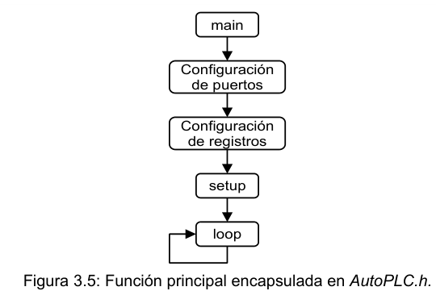
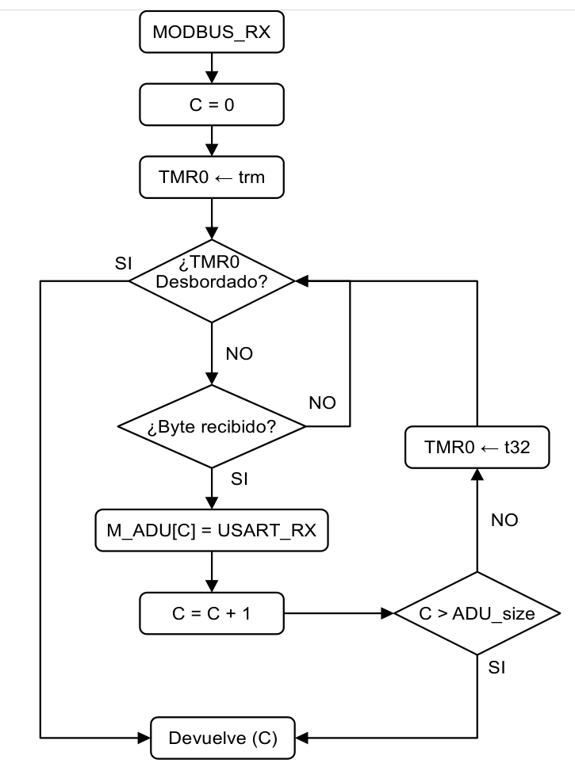
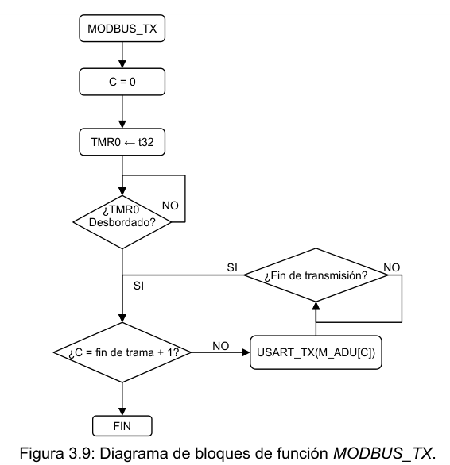
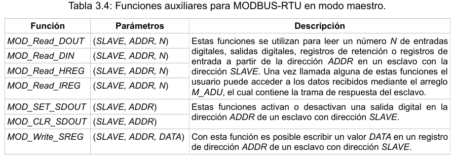
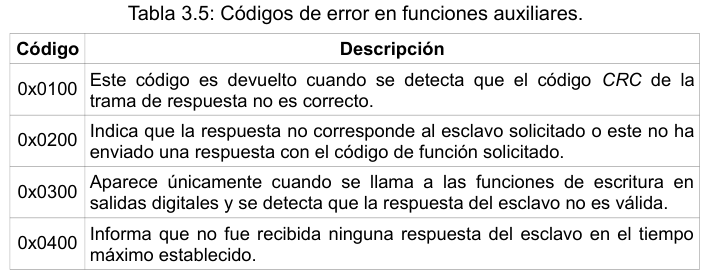

# AutoPLC_lib

Para lograr un mayor nivel de abstracción en el uso de la plataforma diseñada se agrupan las rutinas de interacción con los distintos periféricos del Módulo PLC en una librería llamada AutoPLC.h. Esta librería contiene un paquete de funciones que permiten al usuario manipular las entradas y salidas del Módulo PLC sin tener en cuenta su hardware. También contiene funciones para configurar y realizar transferencias con el módulo EUSART del microcontrolador a través de la interfaz RS-485.

La librería AutoPLC.h encapsula la función principal (main) para llamar a las rutinas de configuración de los registros y puertos del microcontrolador antes de iniciar el código definido por el usuario. Esto también es usado para lograr una estructura de programación más amigable, imitando la estructura “a dos funciones” de Arduino. La Figura 3.5 muestra un diagrama de bloques de la función principal, donde al terminar las rutinas de configuración es llamada a una función setup que el usuario puede utilizar para realizar ciertas configuraciones iniciales personalizadas, como la asignación del tipo de señal captada por cada entrada analógica o la configuración de la interfaz de comunicación serie. Terminadas las tareas definidas en la función setup se inicia un ciclo infinito, donde se llama constantemente a la función loop, en la cual el usuario escribe todo el código a ejecutar por la plataforma.



Otra característica importante de la librería AutoPLC.h es que contiene funciones para la comunicación USB que se basan en la reutilización de las rutinas del bootloader. Como la función HID_transf y la variable HID_RT_sel utilizadas en el bootloader se encuentran en direcciones de memoria conocidas se implementan las funciones HID_tx y HID_rx que modifican el valor de HID_RT_sel en dependencia del tipo de transferencia y realizan una llamada a la dirección de la función HID_transf. También se redefinen los arreglos de 64 byte del endpoint de entrada y de salida como HID_BUFFER_RX y HID_BUFFER_TX respectivamente.

## Lectura y escritura de entradas y salidas digitales

```c
#include "AutoPLC.h"

void setup()
{
    SAINbits.SAI1 = Current; // entrada A1 de corriente
    EAINbits.EAI1 = 1; // activando lectura de entrada A1
}
void loop()
{
    ADIN(); // refrescando valores de entradas activas
    // si A1 > 512 activar DO1, sino desactivar DO1
    if(AIN10reg.A1 > 512) DOUTbits.DO1 = 1;
    else DOUTbits.DO1 = 0;
    REF_DIO();// refrescando E/S digitales
}
```

## Escritura en salidas analógicas e interfaz serie en modo temporizado

- *AutoPLC_config.h*

```c
#define T_IO_REF 50
#define T_tasks 5
#define BAUD 9600
#define EN_PARITY_BIT EVEN
```

- *main.c*

```c
#include "AutoPLC.h"

void setup()
{
    USART_init();
    DOUT = 0;
}
void loop()
{
    DOUT = ~DOUT;
    wait_for(50);
}
void time_tarks()
{
    USART_TX(DIN);
}
```

### Modbus-RTU master

La función MODBUS_RX es utilizada para recibir las tramas MODBUS-RTU. Cuando se llama a esta función se configura la espera máxima de respuesta del esclavo en el timer 0, salvando primeramente el valor de sus registros para reasignarlos una vez terminada la recepción. Luego comienza un ciclo donde se encuesta la bandera de recepción serie hasta recibir un dato o terminar la espera. En el caso de no recibir ningún dato antes del desbordamiento del temporizador, la función devuelve un cero indicando que el tamaño de la trama recibida es nulo. Al recibir un dato este es cargado en el arreglo M_ADU, se incrementa una variable de conteo, se recarga el temporizador con el valor definido para el tiempo de espera entre tramas MODBUS y se retoma el ciclo de recepción de datos. Si la cantidad de datos recibidos supera el tamaño de la ADU, la función termina la recepción de datos y devuelve el valor del tamaño de la ADU. Si el temporizador se desborda la función devuelve la variable de conteo que define el tamaño de la trama recibida. El diagrama de bloques de la Figura 3.8 muestra el funcionamiento de la función MODBUS_RX.



El usuario es el encargado de comprobar que una trama recibida es correcta, recalculando el valor del CRC y comparándolo con el valor de los dos últimos bytes de la trama. Para realizar esto debe llamarse a la función CRC_calc, que recibe como parámetro el tamaño de la trama y devuelve el valor del CRC calculado.

### Transmisión en MODBUS-RTU

Para transmitir datos a los esclavos el usuario debe conformar una trama asignando los valores de cada byte a transmitir en el arreglo M_ADU, incluidos los dos bytes del CRC. Una vez conformada la trama debe llamarse a la función MODBUS_TX para realizar la transferencia. Esta función primeramente recarga el timer 0 para realizar una espera equivalente al tiempo establecido entre tramas MODBUS, para cumplir con las especificaciones temporales de este protocolo. Al concluir esta espera se comienzan a transmitir todos los bytes de la trama de manera consecutiva. La Figura 3.9 muestra un diagrama de bloques de la función MODBUS_TX.



### Funciones auxiliares de alto nivel

Las funciones de transmisión y recepción implementadas anteriormente permiten al usuario utilizar todas las funcionalidades de este protocolo; pero exigen una comprensión a detalles del mismo. La Tabla 3.4 muestra un grupo de funciones diseñadas para facilitar la interacción del usuario con las rutinas más comunes en el protocolo MODBUS-RTU. Estas funciones se encargan de conformar la trama a enviar, esperar la respuesta del esclavo y comprobar si esta es correcta.



Cada una de estas funciones devuelve el tamaño de la trama de respuesta recibida. Si ha ocurrido algún problema en la respuesta del esclavo estas funciones devuelven un código de 16 bits que identifica el tipo de error. La Tabla 3.5 muestra los distintos códigos de error que pueden devolver estas funciones.



____

<dezamora98@gmail.com>
